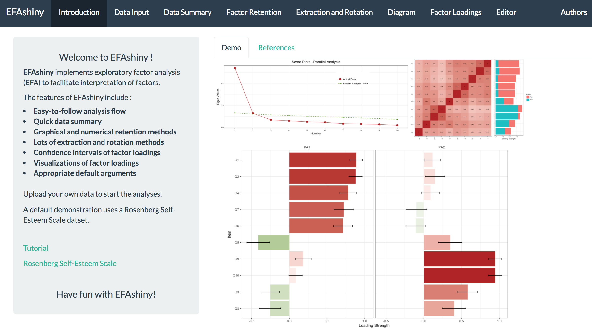
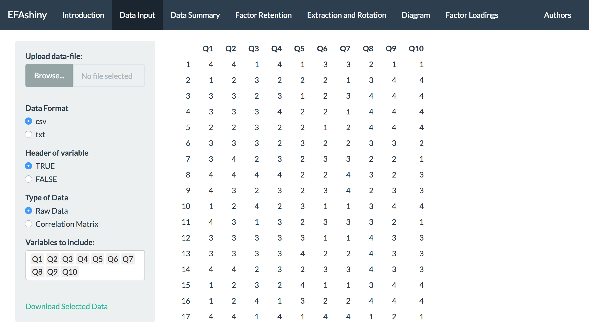
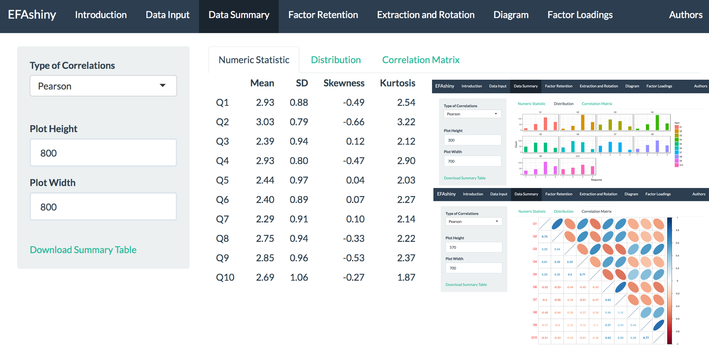
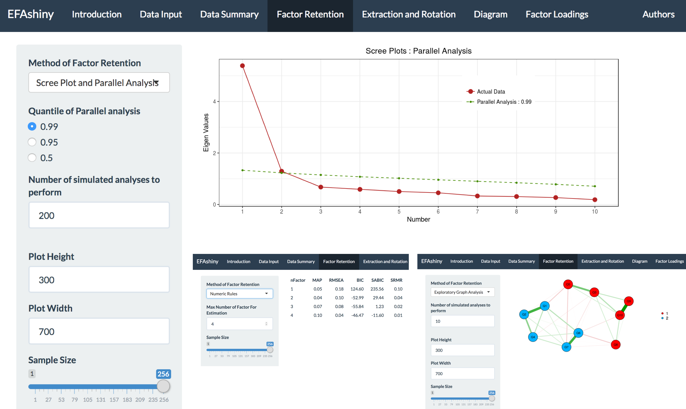
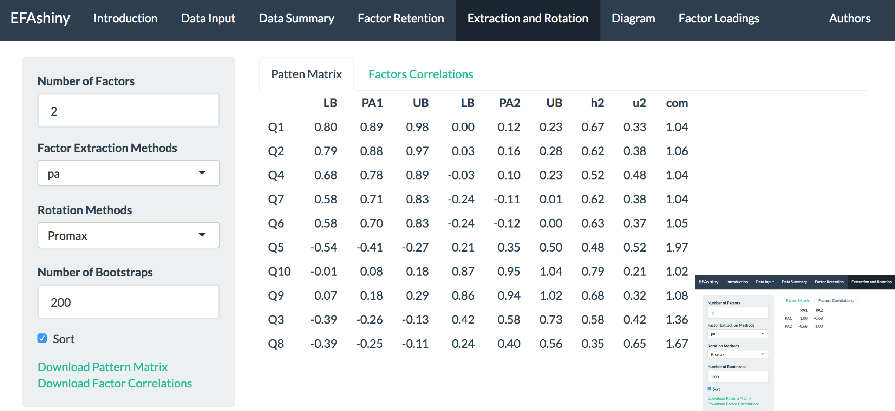
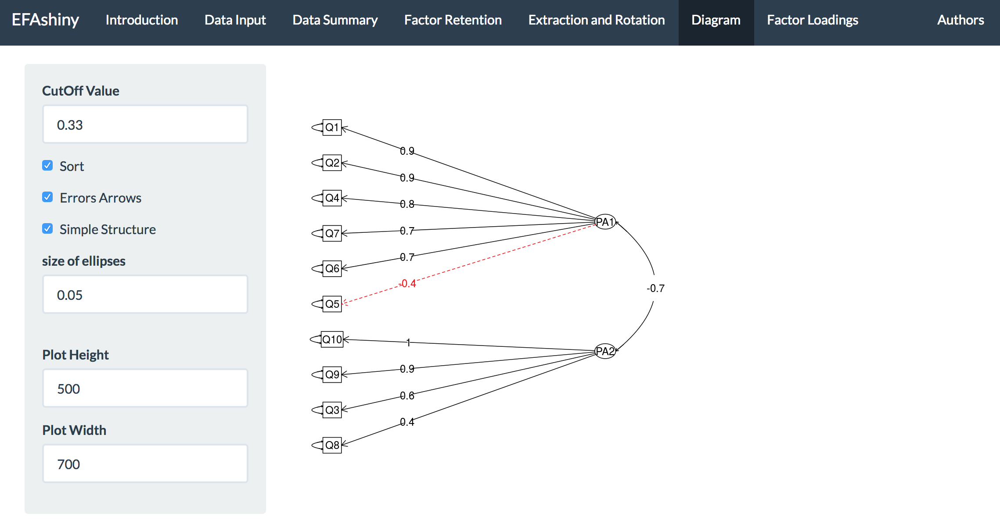
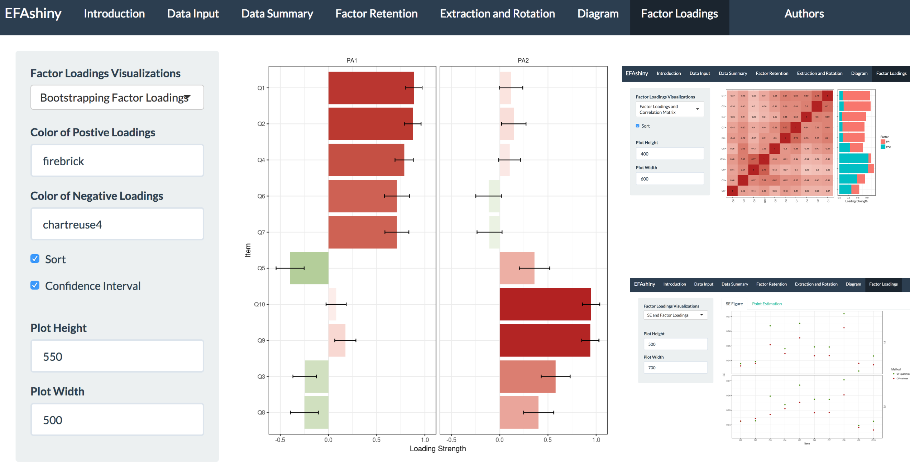

<!-- README.md is generated from README.Rmd. Please edit that file -->
\[\]

[EFAshiny](https://psychilin.shinyapps.io/EFAshiny/)
====================================================

[`EFAshiny`](https://psychilin.shinyapps.io/EFAshiny/) is an user-friendly application for exploratory factor analysis (EFA; Bartholomew, Knott, & Moustaki, 2011). The graphical user interface in shiny (Chang, Cheng, Allaire, Xie, & McPherson, 2017) is designed to free users from scripting in R by wrapping together various packages, such as [`ggplot2`](https://cran.r-project.org/web/packages/ggplot2/ggplot2.pdf) (Wickham, 2016) and [`psych`](https://cran.r-project.org/web/packages/psych/psych.pdf) (Revelle, 2017) R packages, for data management, factor analysis, and graphics. Easy-to-follow analysis flow and reasonable default settings avoiding common errors (Henson & Roberts, 2006) are provided. Results of analysis in tables and graphs are presented on-line and can be exported.

Key features include:

-   Easy-to-follow analysis flow
-   Quick data summary
-   Graphical and numerical retention methods
-   Lots of extraction and rotation methods
-   Confidence intervals of factor loadings
-   Visualizations of factor loadings
-   Default arguments suggested by current research

The intended user of [`EFAshiny`](https://psychilin.shinyapps.io/EFAshiny/) is a behavioral science researcher who seeks an easy way to analyze and visualize item-level scales or datasets with a set of associated variables using EFA.

Getting Started
---------------

#### 1. Shiny APP version (recommended)

If you want to use the `EFAshiny`, installation is not required. The application is deployed on **shinyapps.io** server. <br /> Have fun with `EFAshiny` : <https://psychilin.shinyapps.io/EFAshiny/>

#### 2. Github version

To run `EFAshiny` on your R locally, you have to intsall [`shiny`](https://cran.r-project.org/web/packages/shiny/shiny.pdf) and [`devtools`](https://cran.r-project.org/web/packages/devtools/devtools.pdf). <br /> Then, intsall `EFAshiny` from Github.

``` r
#install.packages("shiny")
#install.packages("devtools")
devtools::install_github("PsyChiLin/EFAshiny")
```

To launch the app:

``` r
EFAshiny::EFAshiny()
```

Tutorial
--------

#### 1. Exploratory Factor Analysis

`EFAshiny` adopts exploratory factor analysis (EFA, Bartholomew, Knott, & Moustaki, 2011), a widely used method to investigate the underlying factor structure that can be used to explain the correlations in a set of observed indicators, as the major procedure in the application. EFA can be useful in lots of situations. For example, it can be used to conceptualize new constructs, to develop instruments, to select items as a short form scale, or to organize observed variables into meaningful subgroups. Major procedures of EFA included correlation coefficients calculation, number of factors determination, factor extraction, and factor rotation. In addition to the aforementioned steps of EFA, data explorations should be conducted before using EFA, and interpreting the results after using EFA is also an important step. Since that EFA is helpful to account for the relationship between numerous variables, its use has permeated fields from psychology to business, education and clinical domain.

#### 2. Introduction

When you open [`EFAshiny`](https://psychilin.shinyapps.io/EFAshiny/), the interface will be shown.<br />

-   **Upper Panel**: The upper panel show 7 main tabs for the EFA procedure. The order of the tabs from left to right is the suggested flow. Users can easily switch the step of the EFA by simply clicking the tabs.
-   **Left Panel**: The left panel is used to control the analysis setting or change the arguments.
-   **Right Panel**: The right panel displays the results, tables and figures.

In the `Introduction` tab, you can see the main features for `EFAshiny`, a demo figure, and some key references.<br />



#### 3. Data Input

The data sets that required the implementations of EFA are typically in a wide format, i.e., one observation per row.<br /> They are composed of a set of responses in one or more psychometric tests in Likert scale.<br /> In the `Data Input` tab, users can upload the data.

-   **Upload data-file**: Users can upload their data by browsing their computer.
-   **Data Format**: Two kinds of data can be uploaded, including csv and txt.
-   **Header of variable**: Users can choose whether their data have variable names or not.
-   **Type of Data**: Two data types for EFA are available, including the typcial subject by variable raw data and the correlation matrix data type.
-   **Variables to include**: User can choose the variables they want to include in the further steps. Simply delete the variable name from the console.

If no data is uploaded, `EFAshiny` will use the [Rosenberg Self-Esteem Scale](https://github.com/PsyChiLin/EFAshiny/blob/master/RSE/RSE.csv) dataset to perform the default demostrations.



#### 4. Data Summary

After uploading the data, the exploratory data analysis should be conducted.<br /> In `Data Summary` tab, three types of explorations are provided.

-   **Numeric Statistic**: The first to fourth order moments for each variable were automatically calculated and printed without worrying about inputting any arguments.
-   **Distribution**: Histograms that demonstrated numbers of observations conditioned on the points of Likert scale (e.g. 1 to 4 points) reported the distribution of each variable.
-   **Correlation Matrix**: A bird’s eye view of the pairwise correlation between variables will be illustrated.
    -   **Type of correlation**: Tetrachoric correlations can be adopted to calculate the correlations between bivariates, and Polychoric correlations can be used on dichotomous ordinal variables. The default argument is set to *Pearson’s correlation coefficients*.

Note that the provided correlation matrix is the basis of EFA, which is a procedure that aim to investigate the underlying structure from the correlations between variables, so either calculating or visualizing the correlation matrix will be really important.



#### 5. Factor Retention

One of the central idea of the EFA is to represent a set of observed variables by a smaller number of factors. Thus, selecting how many factors to retain is a critical decision. <br /> In `Factor Retention` tab, a set of indices to determine numbers of factor are provided.

-   **Scree Plot and Parallel Analysis**: Scree Plot (Cattell, 1966) and Parallel Analysis (Horn, 1965) are two popular methods to determine numbers of factor.
    -   **Quantile of Parallel analysis**: Mean, 95th- and 99th-percentile eigenvalues of random data can be used as criteria.
    -   **Number of simulated analyses to perform**: Users can perform more simulation to obstain reliable results. In general, the default 200 is correct enough.
-   **Numeric Rules**: Velicer's minimum average partial (MAP, Velicer, 1976) test, RMSEA, BIC and SRMR are also provided as the objective numeric rules.
    -   **Max Number of Factor For Estimation**: Users should define their max number of factor to estimate. Should be more than hypothesized.
-   **Exploratory Graph Analysis (EGA)**: EGA is a new approach, which is based on the graphical lasso with the regularization parameter specified using EBIC, for retaining factors (Golino & Epskamp, 2017).
    -   **Number of simulated analyses to perform**: Users can perform more simulation to obstain reliable results. Note that too much simulated analyses will somehow slow down the EGA.

In addition, **Sample Size** is another option for users to validate the results for factor retentions by randomly adjusting different Sample Size.<br /> Although users still have to determine the number of factors upon their own decisions, `EFAshiny` provides users several indices without worrying on methods implementations.



#### 6. Extraction and Rotation

The major step of EFA is to extract and rotate the factors structure, further estimating the factor loadings.<br /> In `Extraction and Rotation` tab, several factor extraction and rotation methods are available, and the boostrapping for estimating confidence intervals of factor loadings is also provided to aide in interpretations.

-   **Factor Extraction Methods**: Available methods included principal axes method (PA), maximum likelihood method (ML), minimum residual method (minres), weighted least squares (WLS), generalized weighted least squares (GLS), and so on. The default option is PA, which has a long history and well performance in psychological studies.
-   **Rotation Methods**: The objective of factor rotation is to obtain a simple structure for better interpretation. Both orthogonal (e.g. variamx method) and oblique rotations (e.g. promax method) are adopted. Using oblique rotations is recommended.
-   **Number of Bootstraps**: By using bootstrapping resampling methods, users can obtain interval estimations rather than point estimations. Number of bootstrapping to perform can be changed based on users’ needs.

By providing plenty of factor extraction methods, rotation methods, and useful interval estimations of factor loadings, `EFAshiny` is not only helpful for EFA newbies, but also flexible for EFA users with many experiences.



#### 7. Diagram

For EFA results, the fundamental visualizations is plotting the relationship between factors and indicators.<br /> In `Diagram` tab, the path diagram representation is provided by using `psych` R package (Revelle, 2017).<br /> It has the structure that all factors and indicators are represented as a bigger or smaller node, and all loadings with absolute values greater than some thresholds (e.g. 0.3) are represented as a line.<br /> Through the graphical representations with flexible plotting options, users can easily understand the factor structure.



#### 8. Factor Loadings

In `Factor Loadings` tab, EFAshiny provides useful visualization of factor loadings to facilitate proper interpretations of extracted factors.

-   **Bootstrapping Factor Loadings**: A table of EFA loadings is presented graphically. Loadings are represented as a bar and conditioned on one or more factors. In order to enhance the interpretability at a glance, positive loadings and negative loadings are presented by different colors. The greater the loadings the deeper the color. Confidence intervals of factor loadings are visualizedto provide quick and useful understanding.
-   **Factor Loadings and Correlation Matrix**: The plot includes the original correlation matrix of the dataset and a stacked bar-graph of the factor loadings is provided for users to make an esay comparison.
-   **SE and Factor Loadings**: The plot visualizes the issue, which indicates oblique CF-varimax and oblique CF-quartimax rotation produced similar point estimates but different standard error estimates (Zhang & Preacher, 2015), by presenting comparison figure. Users can observe whether the phenomenon exists in their empirical dataset.

In addition to providing a table of loadings for EFA results, users can automatically get the whole picture of the EFA results through these visualizations.



#### 9. Summarized Steps

We summarize, in six concrete steps, our provided flow in `EFAshiny` for performing EFA.

1.  Read the data and review it on the main console. Select which variable should be included in further analysis.
2.  Explore the data. For each item, users can examine its numeric statistic, distributions, and correlation patterns.
3.  Use multiple criteria to determine the number of factors.
4.  Perform EFA. Input the number of factors that decided in step 3. The table of EFA results will be presented, including loadings, confidence interval and correlations between factors.
5.  Visualize the results. Three kinds of plots are shown by EFAshiny. Get a general idea of the results from these visualization.
6.  Download and use the results, including figures and tables, in every step for any purpose.

By following this analysis flow in `EFAshiny`, users without any knowledge of programming are able to perform EFA and obtain great understandings for their own studies.

Data
----

The dataset for demonstration is the 10-items Rosenberg Self-Esteem Scale (RSE; Rosenberg, 1965) via [an online platform for psychological research](http://personality-testing.info/_rawdata/). The RSE was recorded in 1 to 4 Likert scale, where higher scores indicated higher agreements for the items (1=strongly disagree, 2=disagree, 3=agree, and 4=strongly agree). Previous studies suggested that the RSE could be treat as a one factor un-dimensional scale, which simply assessed a positive self-evaluation construct, or a two factor bi-dimensional scale, where one factor is proposed to assess positive self-esteem (e.g. I feel that I have a number of good qualities) with another measuring negative self-esteem (e.g. At times I think I am no good at all). `EFAshiny` already implements a 256 participants RSE data as a built-in dataset, but [RSE.csv](https://github.com/PsyChiLin/EFAshiny/blob/master/RSE/RSE.csv) with [codebook](https://github.com/PsyChiLin/EFAshiny/blob/master/RSE/codebook.txt) can also be directly downloaded.

References
----------

-   Bartholomew, D.J., Knott, M., Irini Moustaki, I. (2011). Latent Variable Models and Factor Analysis. A Unified Approach. Wiley.
-   Cattell, R. B. (1966). The scree test for the number of factors. Multivar Behav Res, 1(2), 245-276.
-   Chang, W., Cheng, J., Allaire, J. J., Xie, Y., & McPherson, J. (2017). shiny: Web application framework for R. <http://CRAN.R-project.org/package=shiny> (R package version 1.0.0).
-   Golino, H. F., & Epskamp, S. (2017). Exploratory graph analysis: A new approach for estimating the number of dimensions in psychological research. PloS one, 12(6), e0174035.
-   Henson, R. K., & Roberts, J. K. (2006). Use of exploratory factor analysis in published research: Common errors and some comment on improved practice. Educational and Psychological measurement, 66(3), 393-416.
-   Horn, J. L. (1965). A rationale and test for the number of factors in factor analysis. Psychometrika, 30(2), 179-185.
-   Revelle, W. (2017) psych: Procedures for Personality and Psychological Research, Northwestern University, Evanston, Illinois, USA, <https://CRAN.R-project.org/package=psych> Version = 1.7.8.
-   Rosenberg, M. (1965). Rosenberg self-esteem scale (RSE). Acceptance and commitment therapy. Measures package, 61, 52.
-   Velicer, W. F. (1976). Determining the number of components from the matrix of partial correlations. Psychometrika, 41(3), 321-327.
-   Wickham, H. (2016). ggplot2: elegant graphics for data analysis. Springer.
-   Zhang, G., & Preacher, K. J. (2015). Factor rotation and standard errors in exploratory factor analysis. Journal of Educational and Behavioral Statistics, 40(6), 579-603.

Authors
-------

[**Chi-Lin Yu**](https://github.com/PsyChiLin) : Department of Psychology, National Taiwan University, Taiwan<br /> [**Ching-Fan Sheu**](http://140.116.183.121/~sheu/) : Institute of Education, National Cheng Kung University, Taiwan<br /> <br /> If you have a question, comment, concern or code contribution about `EFAshiny`, please send us an email at <psychilinyu@gmail.com>.
