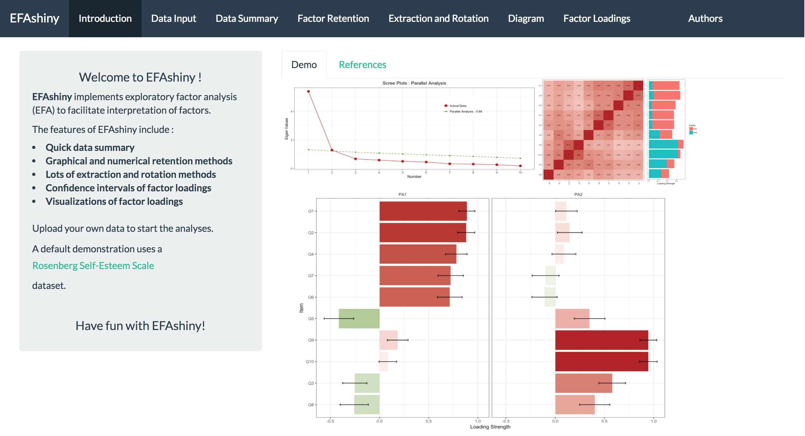

EFAshiny
--------

`EFAshiny` is an user-friendly Shiny APP for EFA users who have some experiences with SPSS. <!-- README.md is generated from README.Rmd. Please edit that file -->

#### Installation

<https://psychilin.shinyapps.io/EFAshiny/>

``` r
library(devtools)
library(shiny)
runGitHub("EFAshiny", "PsyChiLin") 
```

see ref{figurelabel}


